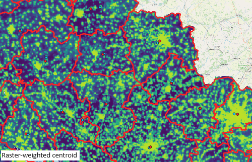

# Network Friction
The purpose of the `net-friction` package is to provide functionality to analyse input point or raster 'incident' data relative to their proximity of network routes, and more specifically, their proximity to pairwise route combinations in a network.

## Acknowledgements
`net-friction` developed by GISRede and was funded by the University of Oxford (insert dept/url) and was used in their population modelling work in Ukraine (url to project and dashboard). Documentation for the package can be found [here](https://network-friction.readthedocs.io/en/latest/).

## Functionality overview

1. Subset, prepare and save networks required for analysis.

2. Create source and destination points as weighted or geometric centroids of boundary date for use in the calculation of pairwise distance matrices.

 

3. Calculate pairwise routes between source and destination points and generate straightline and network distance matrices.

 

4. Extract incidents for analysis from raster, csv or API.

5. Spatially join incidents within given proximity of routes.

6. Aggregate incidents within buffer of respective routes and calculate their distance to the route.

7. Summarise areas of control in both source and destination points.

## Description and suggested workflow
The functions in the package provide output for the following suggested workflow:

1. Subset an input road network dataset (OSM) to required classifications and carry out a crude topology to ensure all edges in the network are connected;
 - See `data_pre_processing` to preprocess and save network edges and source/destination centroids or
 - See `get_roads_data` and `fix_topology`
2. Calculate source/destination point dataset either as centroids of an input boundary dataset, or as weighted centroids from a boundary dataset and an input continuous raster dataset;
 - See `get_source_desitnation_points`
3. Calculate shortest routes from the road network between all pairwise combinations of the source/destination dataset;
4. From these networks, calculate the straight line and network route distances in the source/destination matrix;
5. Extract incident datasets (raster or point, i.e. ACLED) within an input proximity of the routes and aggregate the incidents along the respective pairwise routes;
6. Optionally infer source and destination areas of control in conflict scenarios using pre-defined polygons, for example [Ukraine/Russian areas of control](https://github.com/GISRedeDev/AreasofControl).

**Please see the  [Documentation Page](https://network-friction.readthedocs.io/en/latest/) for a tutorial of the above steps**

## Installation (requires Python >= 3.11)
To install net-friction, use pip:
- `pip install git+https://github.com/GISRedeDev/PyNetworkFriction.git`

## Contributing
Contributions are welcome. Please submit a pull request or create an issue to discuss the changes you want to make.

## License
This project is licensed under the MIT License.
